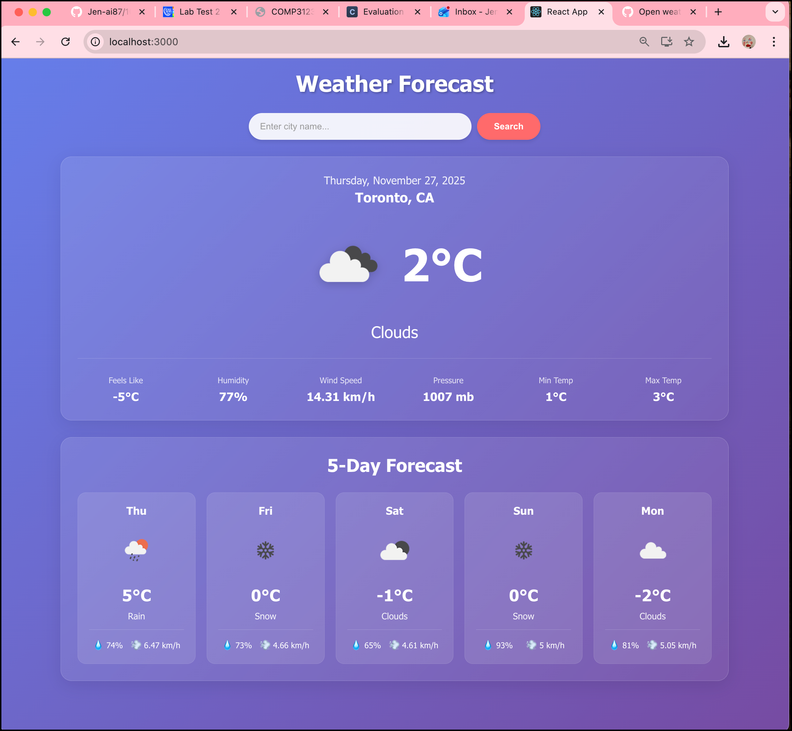

# Weather Forecast App - COMP3123 Lab Test 2

## 👤 Author - Jen Henry

**Student ID**: 101511301  
**GitHub**: [Jen-ai87](https://github.com/Jen-ai87)  
**Repository**: [101511301_comp3123_labtest2](https://github.com/Jen-ai87/101511301_comp3123_labtest2)

## 🌤️ Project description and setup steps
A modern, responsive React weather application that displays current weather conditions and a 5-day forecast for any city worldwide. Built using OpenWeatherMap API with a beautiful glassmorphic UI design.

### Steps to setup the project

1. **Clone the repository**
   ```bash
   git clone https://github.com/Jen-ai87/101511301_comp3123_labtest2.git
   cd 101511301_comp3123_labtest2
   ```

2. **Install dependencies**
   ```bash
   npm install
   ```

3. **Get OpenWeatherMap API Key**
   - Visit [OpenWeatherMap](https://openweathermap.org/api)
   - Sign up for a free account
   - Generate an API key

4. **Configure API Key**
   - Open `src/App.js`
   - Replace `YOUR_API_KEY_HERE` with your actual API key:
   ```javascript
   const API_KEY = 'your_actual_api_key_here';
   ```
5. **Run the application**
   ```bash
   npm start
   ```
   - App will open at `http://localhost:3000`


# 🛠️ Which API was used

1. **Current Weather API**
   ```
   https://api.openweathermap.org/data/2.5/weather?q={city}&appid={API_KEY}&units=metric
   ```

2. **5-Day Forecast API**
   ```
   https://api.openweathermap.org/data/2.5/forecast?q={city}&appid={API_KEY}&units=metric
   ```

### API Response Fields Used

- `main.temp` - Current temperature
- `main.feels_like` - Feels like temperature
- `main.humidity` - Humidity percentage
- `main.pressure` - Atmospheric pressure
- `weather[0].main` - Weather condition
- `weather[0].icon` - Weather icon code
- `wind.speed` - Wind speed
- `name` - City name
- `sys.country` - Country code

## 🧪 Testing the API

A Postman collection is included in the repository for testing the OpenWeatherMap API endpoints.

Import the `Weather_API_Postman_Collection.json` file into Postman to test:
- Current weather endpoint
- 5-day forecast endpoint
- Different cities
- Error scenarios

## 🙏 Acknowledgments

- OpenWeatherMap API for weather data
- React documentation and community
- COMP3123 course materials provided by professor Pritesh

**Note**: Remember to replace `YOUR_API_KEY_HERE` in `App.js` with your actual OpenWeatherMap API key before running the application.

